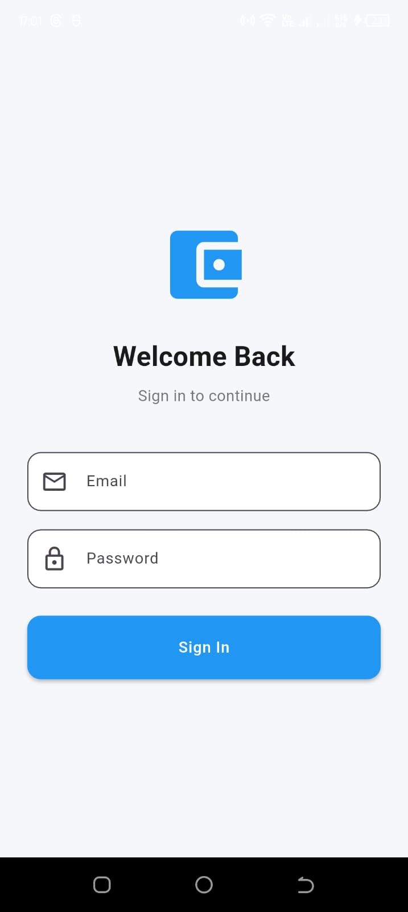
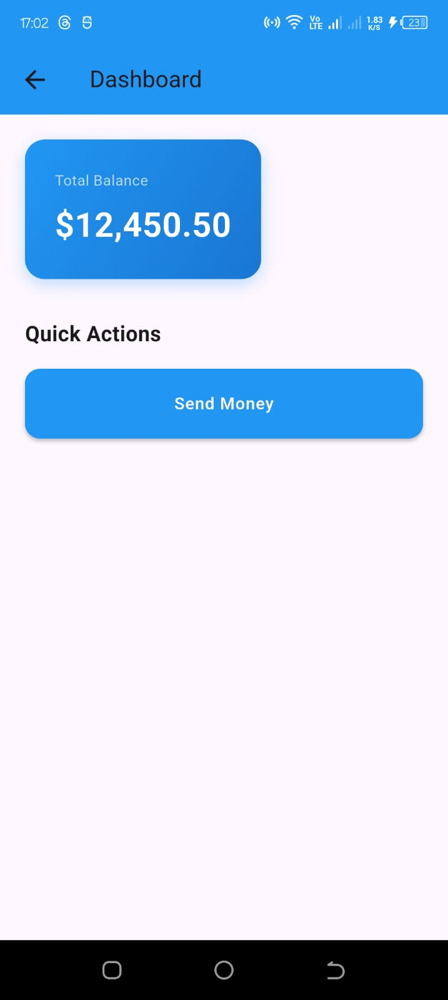
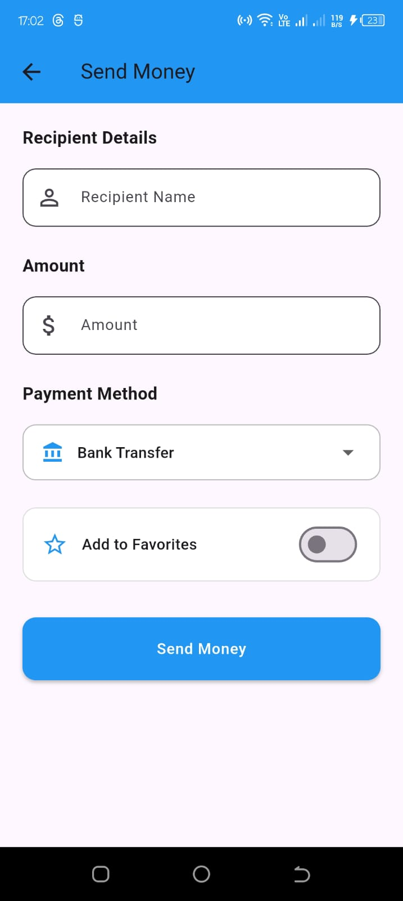
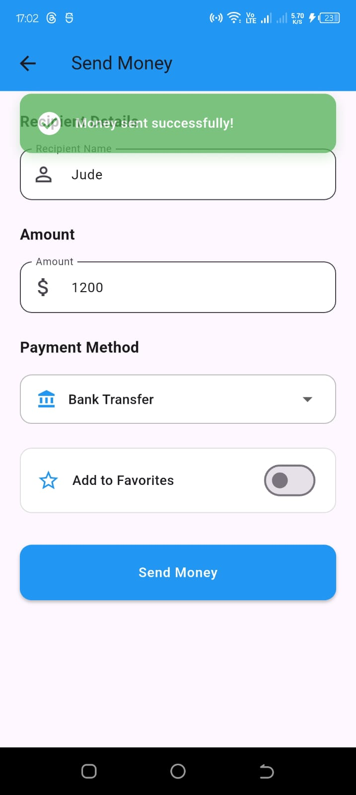

# 💰 Flutter Money Transfer App

A modern, feature-rich Flutter application for sending money with beautiful animations, form validation, and custom reusable widgets.

## 📱 Screenshots

### Login Screen

*Clean and simple login interface with smooth transitions*

### Dashboard

*View your balance and quick actions at a glance*

### Send Money

*Complete form with validation and multiple payment methods*

### Success Animation

*Animated success notification after transaction*

## ✨ Features

### Interactive Widgets
- ✅ **Text Input Fields** with real-time validation
  - Recipient name validation (minimum 3 characters)
  - Amount validation (positive numbers, max $10,000)
- 🎯 **Dropdown Menu** for selecting payment methods
  - Bank Transfer
  - Credit Card
  - Debit Card
  - PayPal
  - Mobile Money
- ⭐ **Favorite Toggle** to save frequent transactions

### Custom Components
- 🎨 **Reusable Button Widget** with:
  - Loading states
  - Customizable colors
  - Consistent styling across the app
- 📦 Modular design for easy maintenance

### Smooth Animations
- 🎬 **Page Transitions** with slide and fade effects
- 🎉 **Success Notifications** with animated appearance
- ⚡ Smooth UI interactions throughout the app

### Form Validation
- 🛡️ Real-time input validation
- 📝 Clear error messages
- ✔️ Visual feedback on invalid inputs

## 🚀 Getting Started

### Prerequisites
- Flutter SDK (3.0 or higher)
- Dart SDK
- Android Studio / VS Code with Flutter extensions
- iOS Simulator / Android Emulator

### Installation

1. **Clone the repository**
   ```bash
   git clone https://github.com/jude-craft/plp-mobile-project-assignments/tree/main/jude
   cd plp-mobile-project-assignments/tree/main/jude
   ```

2. **Install dependencies**
   ```bash
   flutter pub get
   ```

3. **Run the app**
   ```bash
   flutter run
   ```


## 🎨 Design System

### Color Palette
- **Primary**: `#2196F3` (Blue)
- **Primary Dark**: `#1976D2` (Dark Blue)
- **Background**: `#F5F7FA` (Light Gray)
- **Success**: `#4CAF50` (Green)
- **Text Primary**: `#1A1A1A` (Dark Gray)
- **Text Secondary**: `#757575` (Medium Gray)

### Typography
- **Font Family**: Roboto
- **Heading**: 28px, Bold
- **Subheading**: 18-20px, Bold
- **Body**: 16px, Regular
- **Button**: 16px, Semi-Bold

## 🛠️ Built With

- **Flutter** - UI framework
- **Dart** - Programming language
- **Material Design** - Design system

## 📋 Requirements Checklist

### Part 1: Interactive Widgets ✅
- [x] TextField for recipient name
- [x] TextField for amount
- [x] DropdownButton for payment methods
- [x] Switch for favorite transactions
- [x] Form validation with error messages
- [x] Visual feedback on validation

### Part 2: Custom Widgets ✅
- [x] Reusable CustomButton widget
- [x] Consistent styling across components
- [x] Proper color scheme and spacing

### Part 3: Animations ✅
- [x] AnimatedContainer/AnimatedOpacity for success message
- [x] Custom page transitions
- [x] Smooth visual flow between screens

## 🎯 Usage

1. **Login**: Enter any credentials and tap "Sign In"
2. **Dashboard**: View your balance and tap "Send Money"
3. **Send Money**: 
   - Enter recipient name (min 3 characters)
   - Enter amount (positive number, max $10,000)
   - Select payment method from dropdown
   - Toggle favorite if desired
   - Tap "Send Money" to process
4. **Success**: Watch the animated success message appear!

## 🔮 Future Enhancements

- [ ] Transaction history
- [ ] Biometric authentication
- [ ] Multi-currency support
- [ ] Contact list integration
- [ ] Dark mode theme
- [ ] Backend API integration
- [ ] Push notifications
- [ ] Receipt generation

## 🤝 Contributing

Contributions are welcome! Please feel free to submit a Pull Request.

1. Fork the project
2. Create your feature branch (`git checkout -b feature/AmazingFeature`)
3. Commit your changes (`git commit -m 'Add some AmazingFeature'`)
4. Push to the branch (`git push origin feature/AmazingFeature`)
5. Open a Pull Request

## 📄 License

This project is licensed under the MIT License - see the [LICENSE](LICENSE) file for details.

## 👨‍💻 Author

Your Name - Derrick Juma


**Made with ❤️ using Flutter**