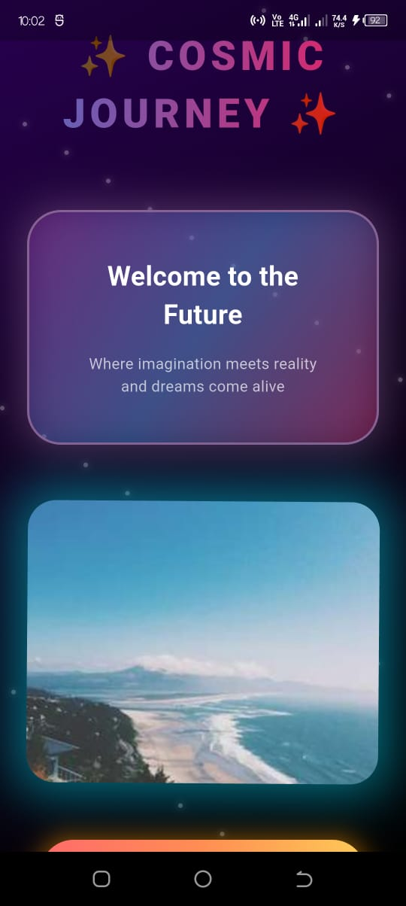
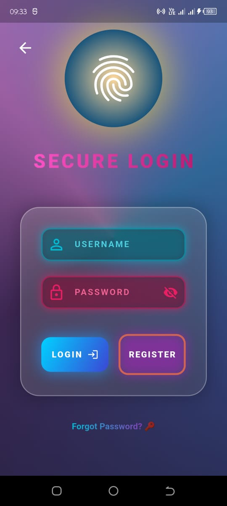

# Nebula

A modern Flutter mobile application focused on providing an exceptional user experience. Nebula is designed with a clean architecture pattern, separating concerns into features and following best practices for Flutter development. The app implements a feature-first architecture approach, making it highly maintainable and scalable.

## Project Structure

```
nebula/
├── lib/
│   ├── features/          # Feature-based modules
│   │   ├── login/         # Login feature implementation
│   │   └── welcome/       # Welcome screen implementation
│   └── main.dart          # Application entry point
├── test/                  # Test files
├── android/               # Android-specific files
├── ios/                   # iOS-specific files
├── web/                   # Web platform files
├── linux/                 # Linux platform files
├── macos/                # macOS platform files
├── windows/              # Windows platform files
└── screenshots/          # Application screenshots
```

### Directory Description

- `lib/`: Contains the main Dart code for the application
  - `features/`: Contains feature-based modules following clean architecture
  - `main.dart`: The entry point of the application
- `test/`: Contains all test files
- `android/`, `ios/`: Platform-specific code and configurations
- `web/`, `linux/`, `macos/`, `windows/`: Platform-specific implementations
- `screenshots/`: Storage for application screenshots

## Features

- Clean and intuitive user interface
- Secure authentication system
- Responsive design for all screen sizes

## Getting Started

### Prerequisites

- Flutter (latest version)
- Dart SDK
- Android Studio / Xcode (for iOS development)

### Installation

1. Clone the repository
2. Navigate to the project directory
3. Install dependencies:
   ```bash
   flutter pub get
   ```
4. Run the app:
   ```bash
   flutter run
   ```

## Screenshots

<details>
<summary>App Screenshots</summary>

### Welcome Screen


### Login Screen



</details>

## Development Resources

For Flutter development help, check out these resources:

- [Flutter Documentation](https://docs.flutter.dev/)
- [Flutter Cookbook](https://docs.flutter.dev/cookbook)
- [Flutter Community](https://flutter.dev/community)

## Contributing

1. Fork the project
2. Create your feature branch
3. Commit your changes
4. Push to the branch
5. Open a Pull Request

## License

This project is licensed under the MIT License.
